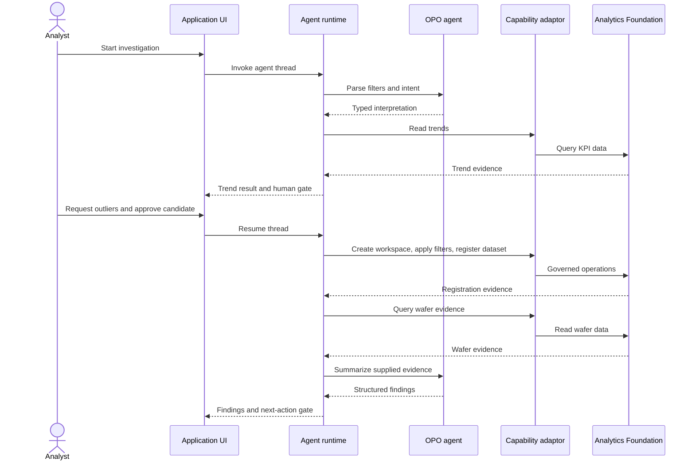

# OPO Investigation Sequence Diagrams

```mermaid
sequenceDiagram
    actor Analyst
    participant UI as Application UI
    participant Runtime as Agent runtime
    participant Agent as OPO agent
    participant MCP as Capability adaptor
    participant Foundation as Analytics Foundation

    Analyst->>UI: Start investigation
    UI->>Runtime: Invoke agent thread
    Runtime->>Agent: Parse filters and intent
    Agent-->>Runtime: Typed interpretation
    Runtime->>MCP: Read trends
    MCP->>Foundation: Query KPI data
    Foundation-->>Runtime: Trend evidence
    Runtime-->>UI: Trend result and human gate
    Analyst->>UI: Request outliers and approve candidate
    UI->>Runtime: Resume thread
    Runtime->>MCP: Create workspace, apply filters, register dataset
    MCP->>Foundation: Governed operations
    Foundation-->>Runtime: Registration evidence
    Runtime->>MCP: Query wafer evidence
    MCP->>Foundation: Read wafer data
    Foundation-->>Runtime: Wafer evidence
    Runtime->>Agent: Summarize supplied evidence
    Agent-->>Runtime: Structured findings
    Runtime-->>UI: Findings and next-action gate
```
