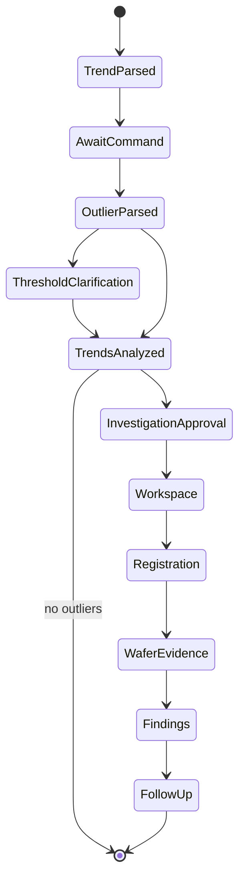

# OPO Investigation State Model

State contains the analyst request, parsed filters, detection rule, threshold context, trend series, deterministic analysis, outliers, selected candidate, workspace and filter evidence, registration history, wafer data, findings, selected action, spatial pattern, and cancellation reason.

## Lifecycle

Checkpoints make interrupts resumable. Secrets do not belong in workflow state.
