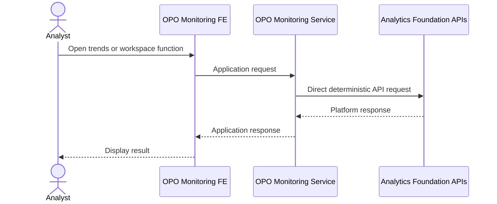
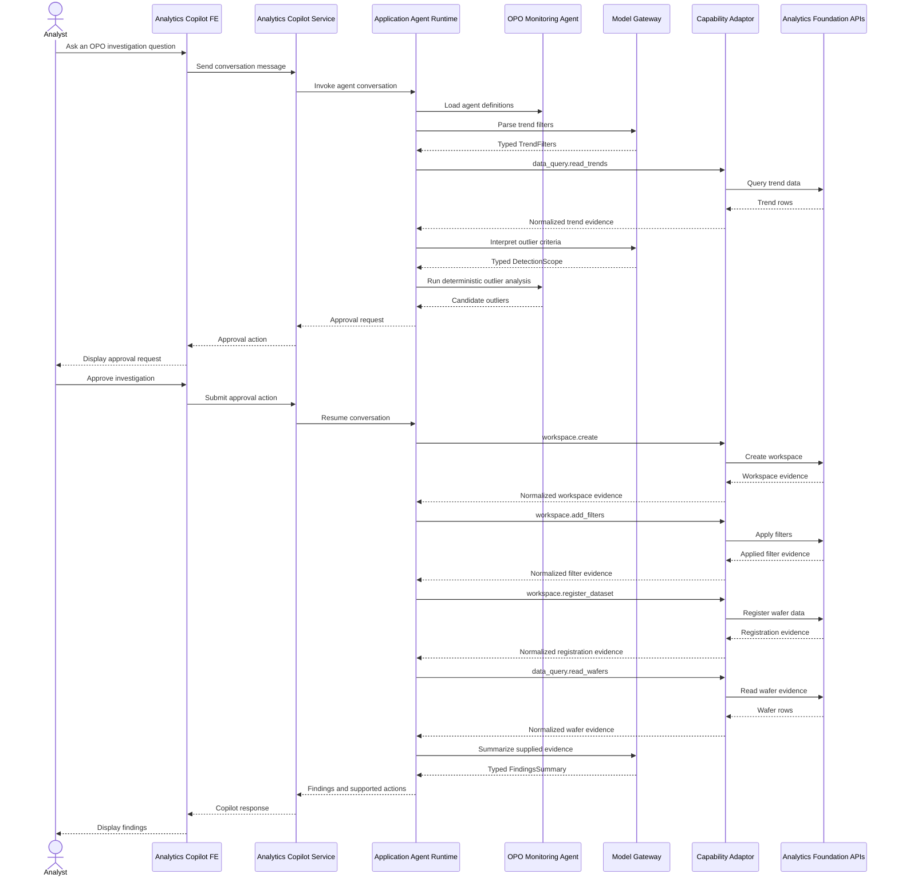
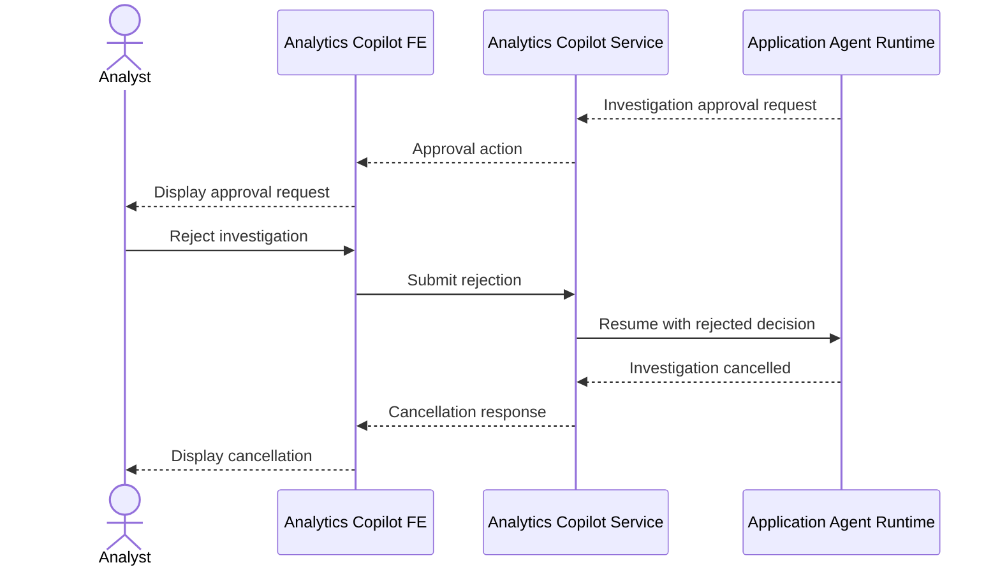

# OPO Monitoring Interaction Sequences

## Existing deterministic application path

The deterministic path does not use the Application Agent Runtime or the
Capability Adaptor.

## Analytics Copilot investigation path

## Rejected approval path

No workspace or data registration operation is executed after rejection.