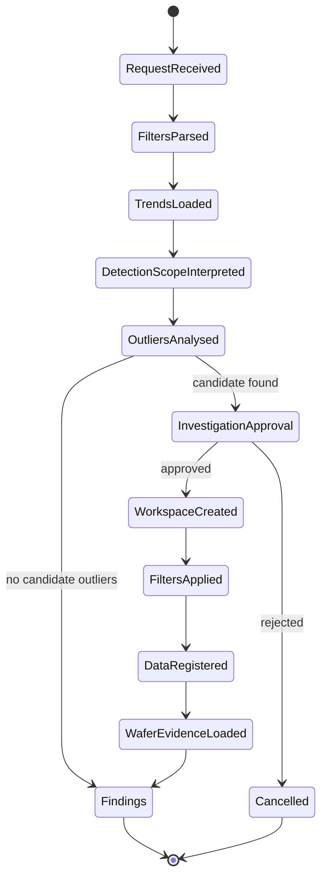

# OPO Monitoring State Model

The state model contains application context, parsed intent, trend evidence,
outlier analysis, human decisions, Analytics Foundation operation results, and
structured findings.

## State rules

- Secrets and credentials must not be stored in workflow state.
- Access tokens must not be stored in workflow state.
- Raw request headers must not be stored in workflow state.
- Every finding must reference evidence available in workflow state.
- Human approval must be recorded before protected capabilities run.
- Capability results must be mapped into explicitly declared state fields.
- Runtime implementation details must not be exposed as business evidence.
- Conversation identifiers must be separated from LangGraph checkpoint IDs.

## State lifecycle

## Evidence state

The following state fields may be cited as evidence:

- `trend_filters`
- `trend_series`
- `detection_scope`
- `analysis`
- `outliers`
- `selected_outlier`
- `workspace`
- `applied_filters`
- `registration`
- `anomalous_wafers`
- `wafer_rows`

The `findings` field is an output derived from evidence. The `findings` field is
not independent source evidence.